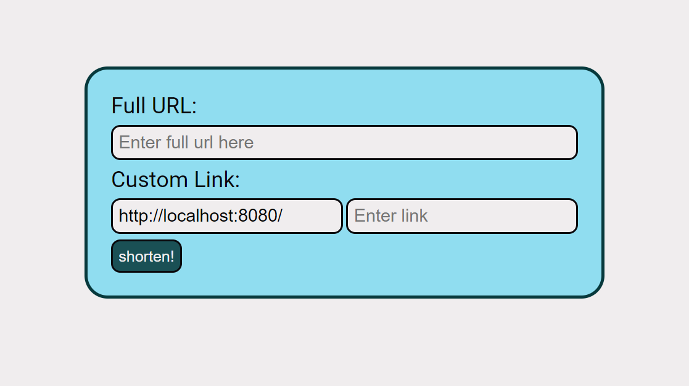
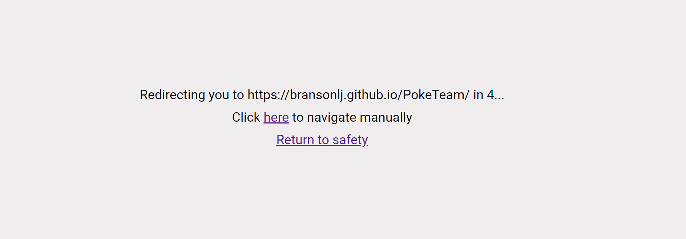

# URL-IRL

URL-IRL is a simple webshortening tool that allows you to compress your url with a custom alias for easy saving and sharing!
<p align="center">
    
</p>

## How to run

### Locally
To run on localhost, first install the dependencies:
```
npm run install:all
```

Then run the full-stack application
```
npm run dev
```

### Docker
Application has been fully containerized on docker, simply run:
```
docker-compose up
```
## Noteable features

* Last used date tracking: Server tracks the last time each custom Alias was used. Inactive Aliases become available again after 1 year without use.

* Safety: When using custom alias links, URL-IRL shows the full url link for 5 seconds before redirecting you, and allows you to cancel the redirect at any time.
<p align="center">
    
</p>

# Acknowledgements

* The Frontend was made with [React](https://react.dev/)
* The Backend was made with [Nodejs](https://nodejs.org/en), [Express](https://expressjs.com/)
* Database used: [MongoDB](www.mongodb.com), [Mongoose](https://mongoosejs.com/)